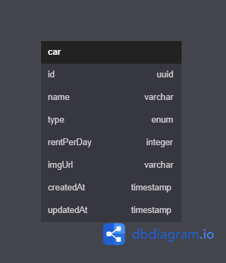

# Challenge Chapter 4 - Car Management Dasboard

This project is about implemetation of Database, Orm and Restful API.

## Database Diagram



## Library

1. cloudinary
2. cookie-parser
3. cors
4. dotenv
5. ejs
6. express
7. multer
8. nodemon
9. pg
10. sequelize
11. uuid

## How To Run

1. Install Library

```bash
npm i
```

2. Create an .env file on root folder

```bash
DB_USERNAME = ''
DB_PASSWORD = ''
DB_NAME = ''
DB_HOST = ''
DB_PORT =
DB_DIALECT = 'postgres'

CLOUD_NAME = ''
API_KEY = ''
API_SECRET = ''
CLODINARY_SECURE = true
```

3. Create Database

```bash
npm run db:create
```

4. Migrating the model

```bash
npm run db:migrate
```

5. Using seeder

```bash
npm run db:seed
```

6. Running Project on development

```bash
npm run dev
```

## EndPoint

### A. Restful API

1. Get All Car | GET: http://{{host}}/api/v1/cars
2. Upload A Car | POST: http://{{host}}/api/v1/cars
3. Get Car by Id | GET: http://{{host}}/api/v1/cars/:id
4. Delete A Car | DELETE: http://{{host}}/api/v1/cars/:id
5. Update A Car | PUT: http://{{host}}/api/v1/cars/:id

### B. Admin

1. Render home page Admin| GET: http://{{host}}/
2. Render create page | GET: http://{{host}}/create
3. Upload A Car | POST: http://{{host}}/admin/create
4. Delete A Car | GET: http://{{host}}/delete/:id
5. Render update page | GET: http://{{host}}/update/:id
6. Update A Car | POST: http://{{host}}/update/:id
